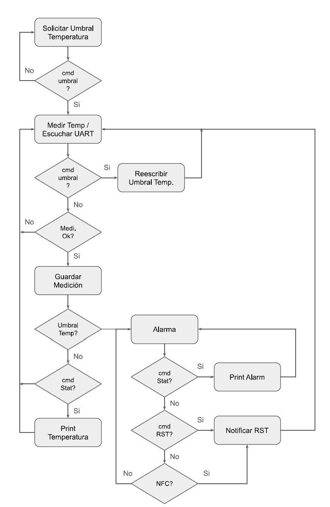

<h1>Final project of the Microcontroller Programming course 🚀</h1>
<h2>Temperature Monitoring System with Alarm and Unlocking via NFC ⚡</h2>

### General Description
- The objective of this Practical Work (WP) is to design an embedded system to continuously monitor temperature using a K-type thermocouple, generate an automatic alarm in the event of overheating, and allow its deactivation using an authorized NFC card or UART commands from a PC.

- The WP integrates modularization concepts discussed in class, the use of peripherals, finite state machines, and other topics covered in the course on communication protocols in embedded systems.

### Used peripherals
1. I2C Peripheral: Temperature sensing will be done through this protocol, communicating with an integrated circuit responsible for reading the thermocouple (MCP9601).
2. SPI Peripheral: This will be used to read NFC/RFID tags or cards, which will deactivate the alarm if the established temperature threshold is exceeded. (MRFC522)
3. UART Peripheral: This will be used to configure the temperature threshold, check status, and reset the alarm.

### Example of FSM flow
1. The system boots up by configuring peripherals.
2. It enters MONITORING mode and periodically measures the temperature.
3. If the temperature has exceeded the threshold: it enters ALARM mode, activating an LED/buzzer and sending an alert via UART.
4. To deactivate the alarm: Authorized NFC/RFID tag or card, or UART command from a PC.
5. The user can periodically check the system status or change the threshold.

  

### MEF State Description
- According to the states and interactions described in Diagram 1, the actions to be executed in each state are briefly described below:
1. Request Temperature Threshold: Checks the incoming UART buffer for the correct command to set the threshold at which the system will alarm.
2. Measure Temperature/Listen to UART: Sends temperature reading commands via I2C and checks the incoming UART buffer.
3. Rewrite Temperature Threshold: Updates the temperature threshold value.
4. Save Measurement: Updates the contents of the temperature variable, for use in reports and comparisons.
5. Alarm: Activates the LED/Buzzer and sends an alarm report via UART.
6. Notify RST: Confirms the reset action via UART.
7. Print Temperature: Notifies the temperature value (can be via UART).
8. Print Alarm: Notify the alarm via UART.

